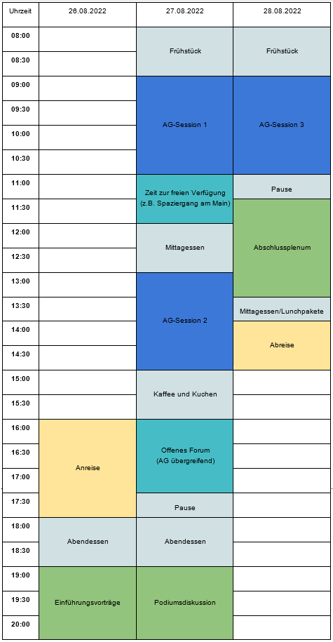

<button class="menuitem" onclick="window.location = 'index.html'">Startseite</button>
<button class="menuitem" onclick="window.location = 'Hintergrund.html'">Hintergrund</button>
<button class="menuitem" onclick="window.location = 'Arbeitsgruppen.html'">Arbeitsgruppen</button>

# Programm

Das Seminar wird am Wochenende des 26.-28.08.2022 in Frankfurt am Main, genauer in der DJH Jugendherberge Frankfurt stattfinden.

Unser Seminar gliedert sich sich in fachliche Arbeitsgruppenarbeit und disziplinenübergreifende Plenarveranstaltungen (siehe Tabellarischer Programmablauf unten). Der Großteil der inhaltlichen Arbeit wird in sechs verschiedenen Arbeitsgruppen stattfinden (siehe AG-Beschreibungen unten). Die AG-Zusammensetzung baut auf einem Rotationsprinzip auf. Das bedeutet, dass Ihr im Laufe des Seminars drei der sechs fachlichen Themenblöcke durchlaufen werdet.

Die AG-Phasen werden durch einen Plenarvortrag und eine Podiumsdiskussion eingerahmt, welche in die Grundideen des Longtermism einführen und zur Diskussion über die Limitierungen dieses Konzepts anregen. Ein Vortrag am Freitagabend wird mit den Grundlagen des Longtermism vertraut machen Speaker:in. Darauf aufbauend erforschen die AG-Phasen am Samstag und Sonntag explizite wissenschaftliche Anwendbarkeit des Longtermism. 

Am Samstagnachmittag habt Ihr im Rahmen eines Networking-Events die Möglichkeit Euch auch AG-übergreifend zu vernetzen und über die fachlichen Themen hinweg mit anderen Teilnehmenden und Dozierenden  individuell zu diskutieren.

Am Samstagabend findet im Rahmen der zweiten Plenarveranstaltung eine Podiumsdiskussion statt, an der die AG-Leitungen teilnehmen. Hier steht im Fokus, bisherige Ergebnisse zusammenzutragen, vor allem aber konfligierende Maßnahmen unter longtermistischer Prämisse zu diskutieren sowie einen breiteren Überblick über Einwände und Kritik am Longtermism zu erhalten. 

Den inhaltlichen Abschluss unseres Seminars bildet ein gemeinsames Plenum, in dem die AGs von den jeweiligen Dozierenden unter Einbeziehung der Ergebnisse der Teilnehmenden abgeschlossen werden. Das Plenum baut auch auf der interdisziplinären Networking Session auf und bildet, mit Blick auf die Leitfragen unseres Seminars, den Rahmen für einen möglichst vielseitige und kritische Betrachtung des Longtermism. Ihr bekommt außerdem Einblicke in die AG-Themen, mit denen Ihr Euch nicht beschäftigt habt und in die weitergeführten Diskussionen zu den Themen, die Ihr konkret bearbeitet habt.

**Ort**: DJH Jugendherberge Frankfurt; Deutschherrnufer 12 60594 Frankfurt

**Kosten**:

| Eigenbeteiligung	                            | Ohne Übernachtung	  |  Mit Übernachtung |
|-----------------------------------------------|---------------------|----------------|
| StipendiatIn der Studienstiftung	            | 30 €	              |  40 € |
| Alumni der Studienstiftung und Externe	      | 60 €	              |  100 € |

